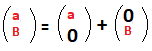
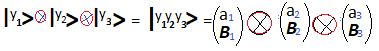
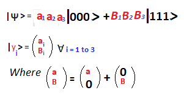
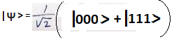

# THIS PAGE IS NOT YET DONE...

The **joint state** of a **system of Qubits** is described using an operation known as **Tensor Product** . Say, we've three ~~individually~~ **independent Qubits**... (**Expresses the fact that state of a Qubit is 2D complex vector**) where  then, the **full state** of a **system** **composed** of **three independent** **Qubits** can be described as...   
 
Expresses the fact that **joint state** of **n Quibits** is the **2^n**D complex vector(**the dimension of vector space is determined solely from the number of basis states**). 
A measurment of this system would collapse the joint state into any of the **2^3** possible **bit-strings** 

### The Entanglement
The **Tensor Product** of **n** **Qubit**s results in a system whose quantum state can be factored as a product of states of its individual constituents...

It is possible for a system of qubits to be in a state that can not be written as the **Tensor Product** of indivdual **Qubit** states. An example of such state is....

States of a system which can not be expressed as a **Tensor Product** of states of its individual subsystems as called **entangled states**. An entangled system is defined to be one whose quantum state can not be factored as a product of states of its local constituents; that is to say, they are not individual particles but are inseparable whole. In entanglement, one constituent can not be fully described without condidering the others.
